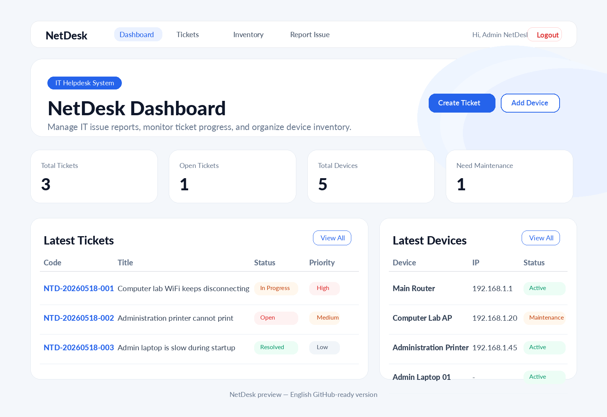

# NetDesk - IT Helpdesk & Asset Management

NetDesk is a simple web application built to help IT administrators manage technical issue reports and office or school device inventory. This project is designed as a portfolio project for IT Support, Network Engineering, and vocational IT students.



## Overview

NetDesk simulates an internal helpdesk system commonly used in small offices, schools, or organizations. Users can submit IT issue reports through a public form, while admins can manage tickets, update ticket status, add handling notes, and track devices such as routers, switches, access points, printers, laptops, PCs, and servers.

## Main Features

- Admin login
- Dashboard summary for tickets and inventory
- Public ticket report form for users or employees
- Helpdesk ticket CRUD
- Ticket status update: Open, In Progress, Resolved, Closed
- Ticket handling notes
- IT device inventory CRUD
- Search and filter data
- Basic input validation
- Output escaping to reduce XSS risk
- Database queries using PDO prepared statements
- Ready-to-import MySQL database
- Responsive Bootstrap interface

## Tech Stack

- Native PHP
- MySQL / MariaDB
- HTML
- CSS
- JavaScript
- Bootstrap CDN

## Demo Account

```txt
Email    : admin@netdesk.local
Password : admin123
```

## Requirements

- PHP 8.1 or newer
- MySQL / MariaDB
- XAMPP, Laragon, or a similar local web server
- Modern web browser

## How to Run on XAMPP

1. Clone or download this repository.
2. Copy the project folder into your `htdocs` directory.
3. Open `phpMyAdmin`.
4. Create a new database named:

```txt
netdesk
```

5. Import this SQL file:

```txt
database/netdesk.sql
```

6. Check the database configuration in:

```txt
config/database.php
```

Default configuration:

```php
const DB_HOST = 'localhost';
const DB_NAME = 'netdesk';
const DB_USER = 'root';
const DB_PASS = '';
```

7. Run the project in your browser:

```txt
http://localhost/netdesk-helpdesk
```

If you rename the folder, adjust the URL based on your folder name.

## Folder Structure

```txt
netdesk-helpdesk/
├── config/
│   └── database.php
├── database/
│   └── netdesk.sql
├── docs/
│   └── screenshots/
│       └── netdesk-preview.png
├── includes/
│   ├── auth.php
│   ├── footer.php
│   ├── functions.php
│   └── header.php
├── inventory/
│   ├── create.php
│   ├── delete.php
│   ├── edit.php
│   ├── form.php
│   └── index.php
├── static/
│   ├── css/
│   │   └── style.css
│   └── js/
│       └── main.js
├── tickets/
│   ├── create.php
│   ├── delete.php
│   ├── index.php
│   └── view.php
├── dashboard.php
├── index.php
├── login.php
├── logout.php
├── report.php
├── README.md
├── LICENSE
└── .gitignore
```

## Database Tables

| Table | Purpose |
| --- | --- |
| `users` | Stores admin and technician accounts |
| `tickets` | Stores IT issue reports |
| `ticket_notes` | Stores ticket handling notes and status changes |
| `devices` | Stores IT device inventory data |

## Basic Workflow

1. A user opens `report.php` to submit an IT issue report.
2. The admin logs in through `login.php`.
3. The admin views ticket and inventory statistics from the dashboard.
4. The admin opens a ticket, updates its status, and adds handling notes.
5. The admin can also manage IT devices through the inventory menu.

## Why This Project Is Good for a Portfolio

This project is useful for a GitHub portfolio because it demonstrates the ability to:

- Build a CRUD web application
- Manage a MySQL database
- Create a simple login system
- Use PDO prepared statements
- Build an admin dashboard
- Understand the IT Helpdesk workflow
- Combine web development with IT Support and Network Engineering needs

## Development Roadmap

- More detailed user and technician roles
- Ticket attachment upload
- Export tickets to PDF/CSV
- Email notification when a ticket is created
- Device change history
- Table pagination
- Simple API for dashboard integration

## Security Notes

This project is built for learning and portfolio purposes. For production use, add environment-based configuration, CSRF protection, login rate limiting, a more complete audit log, and stricter permission management.

## License

This project uses the MIT License. Feel free to use, study, and modify it.
